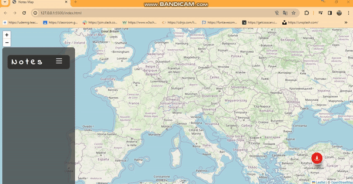

<h1> Notes-Map-App</h1>

This is a simple web application that allows users to add notes with locations on a map.

<h2> Features </h2>

- Add notes with titles, dates, and status.
- Display notes on a map with corresponding markers.
- Click on markers to view note details.
- Delete notes and fly to their locations.

<h2> Technologies Used </h2>

- HTML
- CSS
- JavaScript
- Leaflet.js for map integration
- Bootstrap Icons for icons

<h2> Screenshot </h2>

